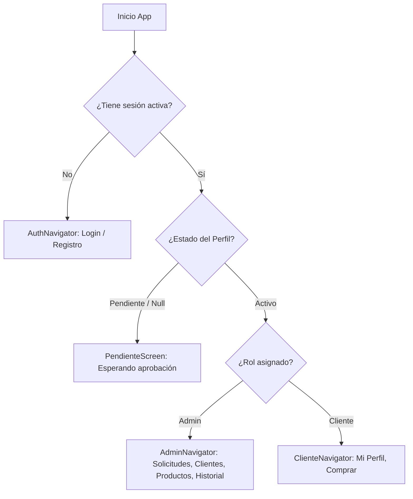

# 📚 Documentación Técnica de la Aplicación Móvil con Supabase

Esta documentación explica la arquitectura, el flujo de datos, el esquema de la base de datos y la integración de **Supabase** con la aplicación móvil/web desarrollada en **React Native / Expo con TypeScript**.

---

## 📑 Tabla de Contenidos
1. [Visión General del Sistema](#-visión-general-del-sistema)
2. [Estructura del Proyecto](#-estructura-del-proyecto)
3. [Configuración e Integración con Supabase](#-configuración-e-integración-con-supabase)
4. [Esquema de la Base de Datos (SQL)](#-esquema-de-la-base-de-datos-sql)
5. [Flujo de Autenticación y Control de Acceso por Roles](#-flujo-de-autenticación-y-control-de-acceso-por-roles)
6. [Funcionalidades e Historias de Usuario (HU)](#-funcionalidades-e-historias-de-usuario-hu)
7. [Guía de Configuración Inicial (Primer Administrador)](#-guía-de-configuración-inicial-primer-administrador)

---

## 🚀 Visión General del Sistema

La aplicación está diseñada bajo una arquitectura basada en **Roles y Estados**:

- **Autenticación segura**: Gestionada mediante Supabase Auth (emails y contraseñas cifradas).
- **Persistencia de Sesión**: Usa `expo-secure-store` en dispositivos móviles (iOS/Android) y `localStorage` en la web.
- **Roles del Sistema**:
  - 🛠️ **Administrador**: Puede aprobar/desactivar cuentas de usuario, asignar roles (`admin` o `cliente`), administrar el catálogo de productos (CRUD) y revisar todas las compras realizadas en la plataforma.
  - 🛒 **Cliente**: Puede gestionar sus datos personales de perfil, explorar el catálogo de productos con control de stock en tiempo real y realizar compras mediante transacciones atómicas.
  - ⏳ **Usuario Pendiente**: Registros nuevos que esperan la aprobación explícita de un Administrador para ingresar a las funciones de la app.

---

## 📁 Estructura del Proyecto

```text
miAppTS/
├── .env                         # Credenciales públicas de Supabase (git-ignored)
├── App.tsx                      # Enrutamiento dinámico según estado de sesión y rol
└── src/
    ├── auth/
    │   └── AuthContext.tsx      # Contexto global de autenticación y carga de perfil
    ├── components/
    │   ├── AuthInput.tsx        # Input estilitzado para autenticación
    │   └── PrimaryButton.tsx    # Botón reutilizable con estados de carga y variantes
    ├── lib/
    │   └── supabase.ts          # Cliente Supabase configurado con adaptador de almacenamiento
    ├── navigation/
    │   ├── BottomTabNavigator.tsx # Navegación por pestañas (AdminTabs y ClienteTabs)
    │   └── types.ts             # Tipado de rutas y parámetros de navegación
    ├── screens/
    │   ├── LoginScreen.tsx      # Inicio de sesión
    │   ├── RegisterScreen.tsx   # Registro de usuario (HU-01)
    │   ├── admin/
    │   │   ├── AdminUsuariosScreen.tsx # Gestión de solicitudes y roles (HU-02)
    │   │   ├── ClientesAdminScreen.tsx # Directorio de clientes registrados
    │   │   ├── ProductosScreen.tsx     # CRUD de productos e inventario
    │   │   └── EncabezadosScreen.tsx   # Historial de compras y detalles
    │   └── cliente/
    │       ├── PerfilClienteScreen.tsx # Gestión de datos del cliente
    │       └── CompraScreen.tsx        # Catálogo, carrito de compras y orden RPC
    ├── theme.ts                 # Sistema de diseño (colores, fuentes Poppins, espaciados)
    └── types/
        └── db.ts                # Tipos TypeScript sincronizados con las tablas de Supabase
```

---

## 🛠️ Configuración e Integración con Supabase

### 1. Variables de Entorno (`.env`)
Las credenciales públicas de Supabase utilizan la convención `EXPO_PUBLIC_` para ser embebidas de manera segura en el paquete de Expo:

```env
EXPO_PUBLIC_SUPABASE_URL=https://TU_PROJECT_ID.supabase.co
EXPO_PUBLIC_SUPABASE_ANON_KEY=eyJhbGciOiJIUzI...
```

### 2. Cliente de Supabase (`src/lib/supabase.ts`)
Inicializa el cliente `@supabase/supabase-js` utilizando un adaptador personalizado que conmuta entre `SecureStore` (móvil) y `window.localStorage` (navegador web):

```ts
import { createClient } from '@supabase/supabase-js';
import * as SecureStore from 'expo-secure-store';
import { Platform } from 'react-native';

const SUPABASE_URL = process.env.EXPO_PUBLIC_SUPABASE_URL!;
const SUPABASE_ANON_KEY = process.env.EXPO_PUBLIC_SUPABASE_ANON_KEY!;

const ExpoSecureStoreAdapter = {
  getItem: (key: string) => {
    if (Platform.OS === 'web') {
      return typeof window !== 'undefined' ? window.localStorage.getItem(key) : null;
    }
    return SecureStore.getItemAsync(key);
  },
  setItem: (key: string, value: string) => {
    if (Platform.OS === 'web') {
      if (typeof window !== 'undefined') window.localStorage.setItem(key, value);
      return;
    }
    return SecureStore.setItemAsync(key, value);
  },
  removeItem: (key: string) => {
    if (Platform.OS === 'web') {
      if (typeof window !== 'undefined') window.localStorage.removeItem(key);
      return;
    }
    return SecureStore.deleteItemAsync(key);
  },
};

export const supabase = createClient(SUPABASE_URL, SUPABASE_ANON_KEY, {
  auth: {
    storage: ExpoSecureStoreAdapter,
    autoRefreshToken: true,
    persistSession: true,
    detectSessionInUrl: false,
  },
});
```

---

## 🗄️ Esquema de la Base de Datos (SQL)

A continuación se detalla el script SQL completo para crear las tablas, relaciones y procedimientos almacenados en Supabase:

```sql
-- 1. TABLA PERFILES (Conectada a auth.users)
CREATE TABLE IF NOT EXISTS public.perfiles (
  id UUID PRIMARY KEY REFERENCES auth.users(id) ON DELETE CASCADE,
  email VARCHAR(255),
  estado VARCHAR(20) NOT NULL DEFAULT 'pendiente' CHECK (estado IN ('pendiente', 'activo')),
  rol VARCHAR(20) NOT NULL DEFAULT 'cliente' CHECK (rol IN ('admin', 'cliente')),
  created_at TIMESTAMPTZ NOT NULL DEFAULT NOW()
);

-- Si la tabla ya fue creada previamente, añadir la columna email:
ALTER TABLE public.perfiles ADD COLUMN IF NOT EXISTS email VARCHAR(255);

-- Sincronizar correos de usuarios ya existentes desde auth.users
UPDATE public.perfiles p
SET email = u.email
FROM auth.users u
WHERE p.id = u.id;

-- Trigger para registrar automáticamente el correo en perfiles al crearse un usuario en auth.users
CREATE OR REPLACE FUNCTION public.handle_new_user()
RETURNS TRIGGER 
LANGUAGE plpgsql 
SECURITY DEFINER
AS $$
BEGIN
  INSERT INTO public.perfiles (id, email, estado, rol)
  VALUES (
    NEW.id, 
    NEW.email, 
    'pendiente', 
    'cliente'
  )
  ON CONFLICT (id) DO UPDATE 
  SET email = EXCLUDED.email;
  
  RETURN NEW;
END;
$$;

DROP TRIGGER IF EXISTS on_auth_user_created ON auth.users;
CREATE TRIGGER on_auth_user_created
  AFTER INSERT ON auth.users
  FOR EACH ROW EXECUTE FUNCTION public.handle_new_user();

-- 2. TABLA CLIENTES (Información personal del cliente)
CREATE TABLE IF NOT EXISTS public.clientes (
  id UUID PRIMARY KEY REFERENCES auth.users(id) ON DELETE CASCADE,
  nombre VARCHAR(100) NOT NULL,
  apellido VARCHAR(100) NOT NULL,
  correo VARCHAR(150) NOT NULL UNIQUE,
  fecha TIMESTAMPTZ NOT NULL DEFAULT NOW()
);

-- 3. TABLA PRODUCTOS
CREATE TABLE IF NOT EXISTS public.productos (
  id UUID PRIMARY KEY DEFAULT gen_random_uuid(),
  nombre VARCHAR(150) NOT NULL,
  descripcion TEXT,
  valor_unitario NUMERIC(12, 2) NOT NULL CHECK (valor_unitario >= 0),
  stock INT NOT NULL DEFAULT 0 CHECK (stock >= 0)
);

-- 4. TABLA ENCABEZADOS (Compras realizadas)
CREATE TABLE IF NOT EXISTS public.encabezados (
  id UUID PRIMARY KEY DEFAULT gen_random_uuid(),
  id_cliente UUID NOT NULL REFERENCES public.clientes(id) ON DELETE RESTRICT,
  fecha TIMESTAMPTZ NOT NULL DEFAULT NOW(),
  total NUMERIC(12, 2) NOT NULL CHECK (total >= 0)
);

-- 5. TABLA DETALLES (Renglones de la compra)
CREATE TABLE IF NOT EXISTS public.detalles (
  id UUID PRIMARY KEY DEFAULT gen_random_uuid(),
  id_encabezado UUID NOT NULL REFERENCES public.encabezados(id) ON DELETE CASCADE,
  id_producto UUID NOT NULL REFERENCES public.productos(id) ON DELETE RESTRICT,
  cantidad INT NOT NULL CHECK (cantidad > 0),
  valor NUMERIC(12, 2) NOT NULL CHECK (valor >= 0)
);

-- 6. FUNCIÓN ALMACENADA (RPC): COMPRA ATÓMICA CON CONTROL DE STOCK
CREATE OR REPLACE FUNCTION public.realizar_compra(
  p_id_cliente UUID,
  p_items JSONB
)
RETURNS UUID
LANGUAGE plpgsql
SECURITY DEFINER
AS $$
DECLARE
  v_encabezado_id UUID;
  v_item JSONB;
  v_producto_id UUID;
  v_cantidad INT;
  v_precio NUMERIC(12,2);
  v_stock_actual INT;
  v_total NUMERIC(12,2) := 0;
BEGIN
  -- Validar que el cliente exista
  IF NOT EXISTS (SELECT 1 FROM public.clientes WHERE id = p_id_cliente) THEN
    RAISE EXCEPTION 'El cliente no existe o debe completar su perfil antes de comprar.';
  END IF;

  -- Calcular total y verificar stock de cada producto antes de procesar
  FOR v_item IN SELECT * FROM jsonb_array_elements(p_items)
  LOOP
    v_producto_id := (v_item->>'id_producto')::UUID;
    v_cantidad := (v_item->>'cantidad')::INT;

    SELECT valor_unitario, stock INTO v_precio, v_stock_actual
    FROM public.productos WHERE id = v_producto_id;

    IF NOT FOUND THEN
      RAISE EXCEPTION 'Producto % no encontrado.', v_producto_id;
    END IF;

    IF v_stock_actual < v_cantidad THEN
      RAISE EXCEPTION 'Stock insuficiente para el producto seleccionado.';
    END IF;

    v_total := v_total + (v_precio * v_cantidad);
  END LOOP;

  -- Insertar Encabezado
  INSERT INTO public.encabezados (id_cliente, total)
  VALUES (p_id_cliente, v_total)
  RETURNING id INTO v_encabezado_id;

  -- Insertar Detalles y Descontar Stock
  FOR v_item IN SELECT * FROM jsonb_array_elements(p_items)
  LOOP
    v_producto_id := (v_item->>'id_producto')::UUID;
    v_cantidad := (v_item->>'cantidad')::INT;

    SELECT valor_unitario INTO v_precio
    FROM public.productos WHERE id = v_producto_id;

    -- Insertar renglón de detalle
    INSERT INTO public.detalles (id_encabezado, id_producto, cantidad, valor)
    VALUES (v_encabezado_id, v_producto_id, v_cantidad, (v_precio * v_cantidad));

    -- Actualizar stock
    UPDATE public.productos
    SET stock = stock - v_cantidad
    WHERE id = v_producto_id;
  END LOOP;

  RETURN v_encabezado_id;
END;
$$;
```

---

## 🔒 Flujo de Autenticación y Control de Acceso por Roles

El componente principal [`App.tsx`](file:///Users/yeisonwaldo/Documents/Dll%20movil/ProyectoApp/miAppTS/App.tsx) evalúa la sesión del usuario a través del hook `useAuth()` y renderiza la pantalla correspondiente:



---

## 📋 Funcionalidades e Historias de Usuario (HU)

### HU-01: Registro de Nuevo Usuario
- **Como**: Visitante del sistema.
- **Quiero**: Registrarme ingresando mi correo electrónico y una contraseña segura.
- **Para**: Solicitar acceso a la plataforma en estado pendiente de aprobación.
- **Criterios de Aceptación**:
  - Validación de formato de correo válido y contraseña segura (mínimo 8 caracteres, números y letras).
  - Generación del registro en `auth.users` y en `public.perfiles` con estado inicial `'pendiente'` y rol `'cliente'`.
  - Mensaje de confirmación informando que la cuenta requiere aprobación del Administrador.

### HU-02: Gestión y Activación de Cuentas por el Administrador
- **Como**: Administrador.
- **Quiero**: Visualizar las solicitudes de registro pendientes para activarlas y asignarles un rol (`Admin` o `Cliente`).
- **Para**: Controlar el acceso a la plataforma.
- **Criterios de Aceptación**:
  - Vista en tiempo real de registros pendientes.
  - Opción de activar seleccionando el rol asignado (`Admin` o `Cliente`).
  - Posibilidad de desactivar o cambiar estado de cuentas en cualquier momento.

### Módulo de Cliente
- **Mi Perfil**: Formulario obligatorio en el primer ingreso para registrar Nombre, Apellido y Correo. Edición dinámica de datos en cualquier momento.
- **Compra de Productos**:
  - Selección de productos del catálogo con stock disponible.
  - Control de cantidades en carrito en tiempo real.
  - Ejecución de la orden mediante la función RPC `realizar_compra`, asegurando que no se pueda comprar más del stock existente.

### Módulo de Administrador
- **Solicitudes de Usuario**: Gestión y aprobación de registros (HU-02).
- **Directorio de Clientes**: Lista detallada de clientes con sus datos de perfil registrados.
- **Gestión de Productos**: Creación, actualización de precios y ajuste de inventario.
- **Historial de Compras**: Listado de facturas y desplegable de ítems por compra.

---

## 🔑 Guía de Configuración Inicial (Primer Administrador)

Cuando conectas un proyecto de Supabase totalmente nuevo, no existe ningún administrador configurado. Para activar tu primera cuenta con rol de Administrador:

1. Registra tu usuario desde la app (ej. `admin@tdea.com`).
2. Entra a tu proyecto en Supabase → **SQL Editor** y ejecuta el siguiente script:

```sql
-- Confirmar correo en la tabla auth.users
UPDATE auth.users 
SET email_confirmed_at = NOW() 
WHERE email = 'admin@tdea.com';

-- Insertar o actualizar el perfil como Activo y Admin
INSERT INTO public.perfiles (id, estado, rol)
VALUES (
  (SELECT id FROM auth.users WHERE email = 'admin@tdea.com'),
  'activo',
  'admin'
)
ON CONFLICT (id) DO UPDATE 
SET estado = 'activo', rol = 'admin';
```

3. Presiona **"Comprobar estado"** o **"Cerrar sesión"** e inicia sesión en la aplicación. ¡Accederás inmediatamente al panel de Administrador!
